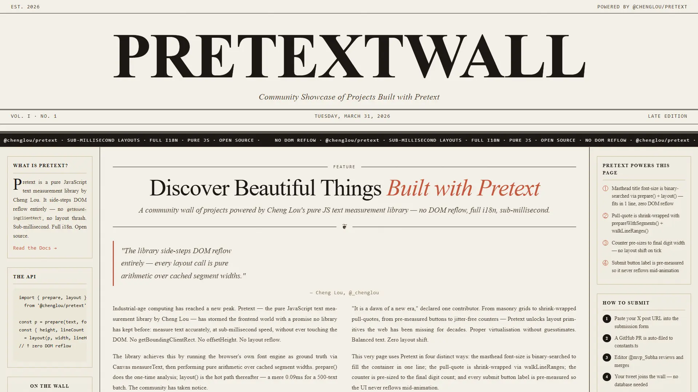

# PretextWall

**The Community Tweet Wall** — a curated, newspaper-style wall of tweets from the community.  
Live at **[pretextwall.netlify.app](https://pretextwall.mvp-subha.me)**

> The Open Graph preview image is auto-generated via Next.js App Router's built-in `opengraph-image.tsx` convention at [`app/opengraph-image.tsx`](app/opengraph-image.tsx). It renders server-side on the Edge and is served at `/opengraph-image` — no manual image file needed.

---

## Features

- **Newspaper-style masthead** — fluid typography using `@chenglou/pretext` for perfect single-line fill
- **Community tweet wall** — masonry grid of curated community tweets powered by `react-tweet`
- **Submit your tweet** — visitors can submit a tweet URL; it's committed directly to `lib/constants.ts` on the `master` branch via the GitHub Contents API
- **Rich tweet cards** — avatar, verified badge, media (photos + autoplay video), like/retweet/reply stats, visit link

---

## Tech Stack

| Layer | Tech |
|-------|------|
| Framework | Next.js 16 (App Router) |
| Language | TypeScript |
| Package manager | Bun |
| Tweet rendering | `react-tweet` |
| Typography | `@chenglou/pretext` |
| Styling | Tailwind CSS v4 + custom CSS variables |
| UI components | shadcn/ui |
| Deployment | Netlify |

---

## Adding Tweets

### Manually

Add a tweet URL to the `COMMUNITY_TWEET_URLS` array in [`lib/constants.ts`](lib/constants.ts) and push to `master`.

### Via the Site

1. Click **Submit a Tweet** on the site
2. Paste any `x.com/…/status/…` URL
3. Preview is shown before submitting
4. On submit, the URL is committed directly to `lib/constants.ts` on `master` via the GitHub Contents API

> The bot finds the insertion point using `// ← BOT_INJECT_ANCHOR (do not remove)` in `constants.ts`. **Do not delete that comment.**

---

## Author

[Subhadeep Roy](https://x.com/mvp_Subha)
